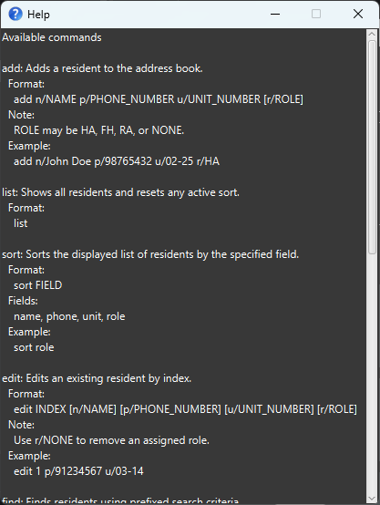

# QuickLookup User Guide

**QuickLookup** is a desktop application for managing a list of residents, optimized for users who prefer fast keyboard input via a **Command Line Interface (CLI)** while still providing a **Graphical User Interface (GUI)** for visual feedback.

It allows users to quickly **view and manage residents** in a locally stored list while providing **useful features** to quicken this process.

<!-- * Table of Contents -->
<page-nav-print />

--------------------------------------------------------------------------------------------------------------------

## Quick start

1. Ensure you have Java `17` or above installed in your Computer. 
   **Mac users:** Ensure you have the precise JDK version prescribed [here](https://se-education.org/guides/tutorials/javaInstallationMac.html).

1. Download the latest `.jar` file from [here](https://github.com/AY2526S2-CS2103-T11-4/tp/releases).

1. Copy the file to the folder you want to use as the _home folder_ for your QuickLookup.

1. Open a command terminal, `cd` into the folder you put the jar file in, and use the `java -jar quicklookup.jar` command to run the application. 
   A GUI similar to the below should appear in a few seconds. Note how the app contains some sample data. 
   

1. Type the command in the command box and press Enter to execute it. e.g. typing **`help`** and pressing Enter will open the help window. 
   Some example commands you can try:

   * `list` : Lists all residents.
   * `sort name` : Sorts the displayed list of residents by name.

   * `add n/John Doe p/98765432 u/02-25 r/HA` : Adds a resident named `John Doe` in unit `02-25` with the `HA` role.

   * `delete 3` : Deletes the 3rd resident shown in the current list.

   * `clear` : Deletes all residents.

   * `exit` : Exits the app.

1. Refer to the [Features](#features) below for details of each command.

--------------------------------------------------------------------------------------------------------------------

## Features

<box type="info" seamless>

**Notes about the command format:** 

* Words in `UPPER_CASE` are the parameters to be supplied by the user. 
  e.g. in `add n/NAME`, `NAME` is a parameter which can be used as `add n/John Doe`.

* Items in square brackets are optional. 
  e.g. `add n/NAME p/PHONE_NUMBER u/UNIT_NUMBER [r/ROLE]` can be used as
  `add n/John Doe p/98765432 u/02-25 r/HA` or as `add n/John Doe p/98765432 u/02-25`.

* Items with `…`​ after them can be used multiple times including zero times. 
  e.g. in the fielded form of `find`, `[n/NAME]...` can be omitted entirely, used once as
  `find n/Alex`, or repeated as `find n/Alex n/David`.

* Prefixed fields in `add`, `edit`, and `find` can be in any order. 
  e.g. if the command specifies `n/NAME p/PHONE_NUMBER u/UNIT_NUMBER`,
  `u/UNIT_NUMBER p/PHONE_NUMBER n/NAME` is also acceptable.

* The name field `n/`'s value must start with an alphanumeric character, and may only contain alphanumeric characters, spaces, hyphens, periods and commas. It must not be blank and must not exceed 100 characters.

* Roles use the `r/` prefix. Valid role values are
    * `HA`
    * `FH`
    * `RA`
    * `NONE` (_default option; explicitly not needed_); useful with `edit` when you want to remove an assigned role.

* Extraneous parameters for `help`, `list`, `exit`, and `clear` are ignored. 
  e.g. `help 123` is interpreted as `help`.

* `copy` accepts no parameters. 
  e.g. `copy 1` is invalid and does not copy the 1st resident.

* If you are using a PDF version of this document, be careful when copying and pasting commands that span multiple lines as space characters surrounding line-breaks may be omitted when copied over to the application.
</box>

### Viewing help : `help`

Shows a message displaying a list of available commands.

Format: `help`

### Adding a resident: `add`

Adds a resident to the address book.

Format: `add n/NAME p/PHONE_NUMBER u/UNIT_NUMBER [r/ROLE]`

* `PHONE_NUMBER` and `UNIT_NUMBER` must each be unique across residents.

<box type="tip" seamless>

**Tip:** `ROLE` is optional. If provided, it must be one of `HA`, `FH`, `RA`, or `NONE`. (`ROLE` defaults to `NONE` if not used)
</box>

Examples:
* `add n/John Doe p/98765432 u/02-25`
* `add n/Jane Tan p/91234567 u/05-12 r/FH`

### Listing all residents : `list`

Shows a list of all residents in the address book.
This also resets any active sort and returns the displayed list to its default order.

Format: `list`

<box type="info" seamless>

**View Reset Behavior:** The following commands reset the filtered view and show all residents again:
* `list` - Resets both filtered and sorted views to default
* `add` - Resets filtered view when adding a new resident
* `edit` - Resets filtered view when editing a resident

The `find` command updates the filtered view to show search results but preserves any active sort.

**Note on `sort` command**: When you apply a sort, the filtered view is reset to show all residents, and the sorting is applied to this complete default list. This ensures consistent sorting across all data.
</box>

### Sorting the displayed resident list : `sort`

Sorts the displayed list of residents by the specified field.

Format: `sort FIELD`

* `FIELD` must be one of `name`, `phone`, `unit`, or `role`.
* Sorting affects the currently displayed list of residents.
* `sort role` orders residents by role precedence: `HA`, `FH`, `RA`, then residents without a role.
* **Sorted view is temporary and not persistent**: The sort order is only applied to the current session and is lost when the application exits. It also resets when you use `list`, `add`, or `edit` commands.
* `list` resets the displayed order back to the default order.

Examples:
* `sort name`
* `sort phone`
* `sort unit`
* `sort role`

### Editing a resident : `edit`

Edits an existing resident in the address book.

Format: `edit INDEX [n/NAME] [p/PHONE_NUMBER] [u/UNIT_NUMBER] [r/ROLE]`

* Edits the resident at the specified `INDEX`. The index refers to the index number shown in the displayed resident list. The index **must be a positive integer** 1, 2, 3, …​
* At least one of the optional fields must be provided.
* Existing values will be updated to the input values.
* The updated `PHONE` and `UNIT_NUMBER` must not duplicate another resident's values.
* If `ROLE` is provided, it must be one of `HA`, `FH`, `RA`, or `NONE`.
  * If `NONE` is provided, it will unassign any assigned role (i.e., `HA`, `FH` or `RA`) from the resident.

Examples:
* `edit 1 p/91234567 u/03-14` edits the phone number and unit number of the 1st resident.
* `edit 2 n/Jane Tan r/NONE` edits the name of the 2nd resident and removes the resident's assigned role.

### Locating residents: `find`

Finds residents using prefixed search criteria.

Format:
* `find [n/NAME]... [p/PHONE_NUMBER]... [u/UNIT_NUMBER]... [r/ROLE]...`

Rules:
* At least one prefixed search term must be provided.
* Every search term must be prefixed.
* `n/` matches resident names word-by-word, case-insensitively.
* A name word matches if it contains the `n/` search term, or if the whole name word differs from the search term by at most one single-character edit: one insertion, deletion, or substitution.
* The one-edit rule does not treat the search term as a wildcard. For example, `find n/A` can match a resident named `C`, but not a resident named `CC`, because changing `A` into `CC` needs more than one edit.
* `p/` matches phone numbers by substring.
* `u/` matches unit numbers by case-insensitive substring.
* `r/` matches resident roles exactly.
* Use `r/NONE` to match residents with no role.
* Multiple search terms within the same field are combined using `OR`.
* Different fields are combined using `AND`.
* Each `n/` search term can contain only one word; `find n/John Doe` is invalid.
* Unprefixed text is invalid.
  e.g. `find 9876 n/Bob` and `find n/Alex Bob` are not allowed

Examples:
* `find n/John` returns residents whose names contain a word matching `John`
* `find n/Al` can match residents named `Alex Tan` or `Alice Pauline`
* `find n/Karl` can match a resident named `Carl Kurz`
* `find n/Alex n/David` returns residents whose names contain either a word matching `Alex` OR `David`
* `find p/9876` returns residents whose phone numbers contain `9876`
* `find u/02-25` returns residents whose unit numbers contain `02-25`
* `find r/HA` returns residents whose role is `HA`
* `find r/NONE` returns residents with no role assigned
* `find n/Alex p/9876 u/02-25 r/HA` returns residents matching all specified field criteria

### Deleting a resident : `delete`

Deletes the specified resident from the resident list.

Format: `delete INDEX`

* Deletes the resident at the specified `INDEX`.
* The index refers to the index number shown in the displayed resident list.
* The index **must be a positive integer** 1, 2, 3, …​

Examples:
* `list` followed by `delete 2` deletes the 2nd resident in the address book.
* `find n/Betsy` followed by `delete 1` deletes the 1st resident in the results of the `find` command.

### Copying resident information : `copy`

Copies all the displayed resident information to your device's clipboard.

Format: `copy`

* Copies all available resident information currently displayed.
* The copied information includes the names, phone numbers, unit numbers, and roles of all residents in the current view.
* `copy` does not accept an index or any other parameter. Use `list` or `find` first to choose the current view.

Examples:
* `list` followed by `copy` copies all residents' information in the address book.
* `find n/Betsy` followed by `copy` copies the information of all residents matching the search results.

### Clearing all entries : `clear`

Clears all entries from the resident list.

Format: `clear`

### Exiting the program : `exit`

Exits the program.

Format: `exit`

### Saving the data

QuickLookup data are saved in the hard disk automatically after any command that changes the data. There is no need to save manually.

### Editing the data file

QuickLookup data are saved automatically as a JSON file `[JAR file location]/data/addressbook.json`. Advanced users are welcome to update data directly by editing that data file.

<box type="warning" seamless>

**Caution:**
If your changes to the data file makes its format invalid, QuickLookup will discard all data and start with an empty data file at the next run.  Hence, it is recommended to take a backup of the file before editing it. 
Furthermore, certain edits can cause the QuickLookup to behave in unexpected ways (e.g., if a value entered is outside the acceptable range). Therefore, edit the data file only if you are confident that you can update it correctly.

**Important:**
* **Valid roles**: Ensure that the `role` field contains only valid values: `HA`, `FH`, `RA`, or `NONE`. Using any other role value will cause the application to treat it as invalid, resulting in data not being loaded at all.
* **No duplicate contacts**: Do not create duplicate entries with the same phone number or unit number, as the application enforces uniqueness constraints for these fields and may behave unexpectedly if duplicates are present.
</box>

### Navigating command history using arrow keys

QuickLookup tracks your current session's command history for quick retrieval using the arrow keys. After navigating to a past command, you may execute it again by pressing Enter, or edit it before executing.

While the command box is focused, press:
- Up Arrow Key (`↑`) to display earlier commands.
  - If you are already at the earliest command or there is no history, the Up Arrow Key brings the cursor to the front of the Command Box
- Down Arrow Key (`↓`) to display more recent commands.
  - If you are already at the latest command in history, the Down Arrow Key clears the Command Box.
  - If you are already at the present, the Down Arrow Key brings the cursor to the end of the Command Box.

While editing the currently displayed past input:
- Navigation position in history is maintained. That is, despite editing, pressing:
  - Up Arrow Key (`↑`) will still navigate to the command directly earlier (if available).
  - Down Arrow Key (`↓`) will still navigate to the command directly more recent (if available).

--------------------------------------------------------------------------------------------------------------------

## FAQ

**Q**: How do I transfer my data to another Computer? 
**A**: Install the app in the other computer and overwrite the empty data file it creates with the file that contains the data of your previous QuickLookup home folder.

--------------------------------------------------------------------------------------------------------------------

## Known issues

1. **When using multiple screens**, if you move the application to a secondary screen, and later switch to using only the primary screen, the GUI will open off-screen. The remedy is to delete the `preferences.json` file created by the application before running the application again.
2. **After editing a resident displayed in a filtered list view**, the list will reset to the default view (i.e. no filters) instead of maintaining the filtered view. This bug was raised for fixing in the v1.5 milestone's development timeline, but was ultimately not achievable within the time constraints given the priorities of other bugs and the workload constraints of the team, and has thus been classified as "Out of Scope" as advised [here](https://nus-cs2103-ay2526-s2.github.io/website/schedule/week11/project.html?cv-highlight=tpMustWeFixAllBugs).

--------------------------------------------------------------------------------------------------------------------

## Command summary

Action     | Format, Examples
-----------|----------------------------------------------------------------------------------------------------------------------------------------------------------------------
**Add**    | `add n/NAME p/PHONE_NUMBER u/UNIT_NUMBER [r/ROLE]`   e.g., `add n/James Ho p/22224444 u/02-25 r/HA`
**Clear**  | `clear`
**Copy**   | `copy`
**Delete** | `delete INDEX`  e.g., `delete 3`
**Edit**   | `edit INDEX [n/NAME] [p/PHONE_NUMBER] [u/UNIT_NUMBER] [r/ROLE]`  e.g.,`edit 2 n/James Lee p/89824392`
**Find**   | `find [n/NAME]... [p/PHONE_NUMBER]... [u/UNIT_NUMBER]... [r/ROLE]...`  e.g., `find n/James n/Jake`, `find n/James p/2222 u/02-25 r/HA`, `find r/NONE`
**List**   | `list`
**Help**   | `help`
**Sort**   | `sort FIELD`  e.g., `sort role`
**Exit**   | `exit`
